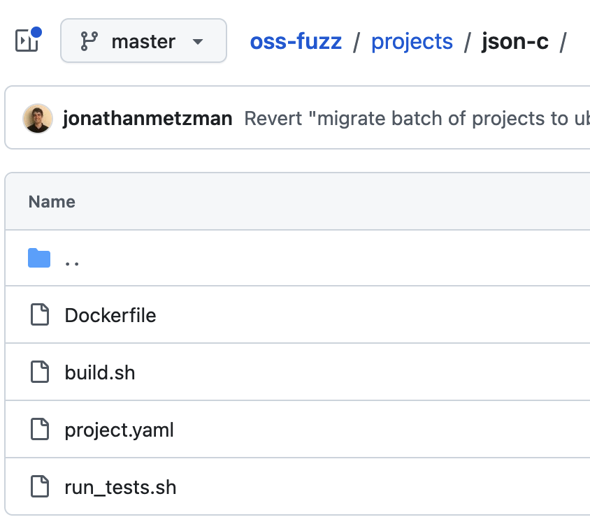
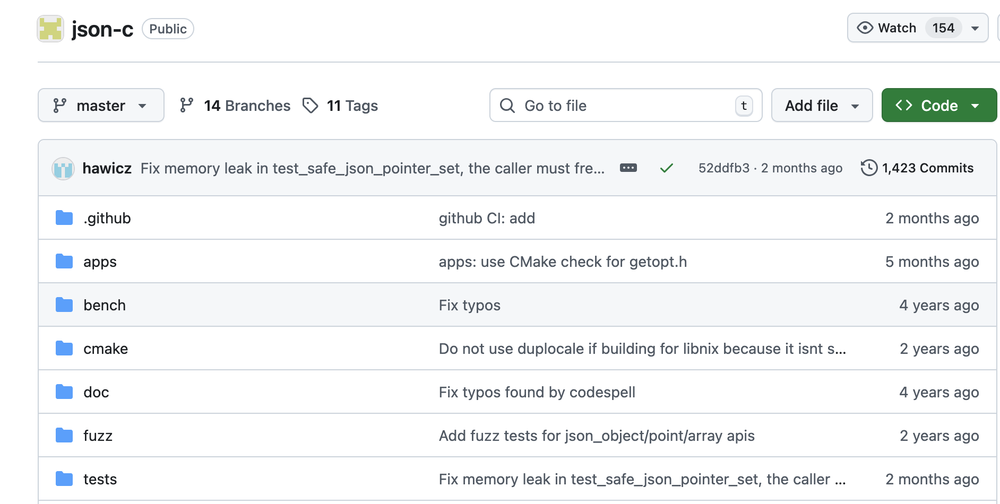
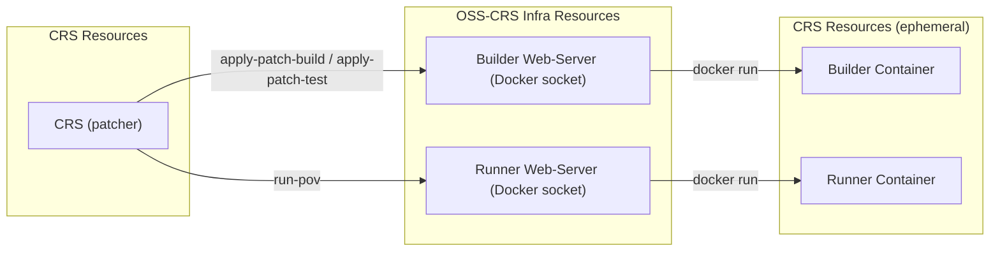

# Meeting Notes

OpenSSF Cyber Reasoning Systems Special Interest Group

---

## Agenda

1. New APIs for CRS Development
2. AIxCC CRS Integration Progress

---

## 1. New API: `download-source` Refactor ([#133](https://github.com/ossf/oss-crs/pull/133))

### Breaking Change
Old API → New API:

| Old | New |
|-----|-----|
| `download-source target <dst>` | `download-source fuzz-proj <dst>` |
| `download-source repo <dst>` | `download-source target-source <dst>` |
| `download_source()` returns `Path` | returns `None` |

---

## 1. New API: Source Provenance

<style scoped>img { max-height: 420px; display: block; margin: auto; }</style>

**`fuzz-proj`** — oss-fuzz integration (`oss-fuzz/projects/<target>/`)



---

## 1. New API: Source Provenance (cont.)

<style scoped>img { max-height: 420px; display: block; margin: auto; }</style>

**`target-source`** — project repo (from `--target-source-path` or Dockerfile `WORKDIR`)



---

## 1. New API: Invocation (via libCRS)

```bash
# Copy fuzz project files (from oss-fuzz/projects/<target>/)
libCRS download-source fuzz-proj /work/project

# Copy target source tree (for patch generation, analysis, etc.)
libCRS download-source target-source /work/src
```

---

## 1. New API: Builder Sidecar ([#162](https://github.com/ossf/oss-crs/pull/162))

Replaces long-running builder sidecar server with **ephemeral containers** launched per build from a snapshot image.

### New libCRS Commands
```bash
libCRS apply-patch-build <patch> <out> [--builder BUILDER]
libCRS apply-patch-test  <patch>        [--builder BUILDER]
libCRS run-pov           <pov> <harness> [--rebuild-id ID] [--builder RUNNER]
libCRS download-build-output <src> <dst> [--rebuild-id ID] [--builder BUILDER]
```

---

## 1. New API: Builder Sidecar (cont.)

### Enabling Incremental Builds
- `--incremental-build` passed to both `oss-crs build-target` and `oss-crs run`
- `build-target --incremental-build` → creates a snapshot Docker image of the compiled target
- `run --incremental-build` → ephemeral containers launch per patch from the snapshot
- Without the flag → each rebuild starts fresh from the base image

### Why Use It?
- ✅ Much faster patch-rebuild and test cycles — no full recompile from scratch per patch
- ⚠️ Risk of breakage if build commands break on reruns 

---

## 1. New API: Builder Sidecar Architecture

<style scoped>img { max-height: 420px; display: block; margin: auto; }</style>



---

## 2. AIxCC CRS Integration Progress

### Completed this period
- Shellphish
- Theori
- Fuzzing Brain

### In Progress
- 42-b3yond-6ug

---

## 2. AIxCC CRS Integration Progress (cont.)

### Next Steps
- CRS verification (some sort of quality baseline for registering)

---

## Q&A / Discussion

Refer to Cyber Reasoning Systems bi-weekly meeting notes.
